## In questa presentazione {.smaller}

Quante donne giocano a calcio nelle cinque principali federazioni europee?
Come sta crescendo questo numero, e chi lo sta guidando?

In questa analisi confrontiamo **Francia, Germania, Spagna, Italia e Inghilterra**
usando dati ufficiali di federazione (o, nel caso inglese, dati di indagine nazionale)
dal 2013-14 al 2024-25.

La struttura è la seguente:

1. Il problema della misurazione: cinque paesi, cinque sistemi diversi
2. Paese per paese: Germania, Inghilterra, Francia, Spagna, Italia
3. Il confronto: cosa cambia quando mettiamo tutto insieme

# Parte 1 · Il problema della misurazione

Ogni paese misura la partecipazione calcistica in modo diverso.
Prima di confrontare qualsiasi numero, dobbiamo capire cosa stiamo misurando.

## Cinque paesi, cinque sistemi diversi {.smaller}

> Questi numeri **non sono direttamente confrontabili** tra loro. Un *Mitglied* tedesco non è la stessa cosa di una *licenciée* spagnola, e nessuno dei due è uguale a un partecipante stimato dall'indagine inglese.

| Paese       | Fonte                      | Cosa misura                                |
|-------------|----------------------------|--------------------------------------------|
| Germania    | DFB Mitgliederstatistik    | Membri di club federati (attivi e passivi) |
| Francia     | INJEP                      | Licenze di gioco                           |
| Spagna      | RFEF Memoria Anual         | Licenze di gioco (calcio outdoor)          |
| Italia      | FIGC ReportCalcio          | Tesserati (licenze di gioco)               |
| Inghilterra | Sport England Active Lives | Stima da indagine campionaria              |

## Perché non si possono confrontare i numeri in assoluto {.smaller}

Il problema non è solo di definizione. È anche di **scala**:

- Germania: circa **7-8 milioni** di Mitglieder totali
- Francia: circa **2 milioni** di licenze
- Spagna: circa **1 milione** di licenze (solo calcio outdoor)
- Italia: circa **1,3 milioni** di tesserati
- Inghilterra: circa **2 milioni** di partecipanti stimati

Confrontare questi valori assoluti significherebbe confrontare mele con arance.

La soluzione è guardare **la direzione e la velocità del cambiamento**, non il numero in sé.

## La soluzione: l'indice di crescita

Settiamo il valore di ciascun paese a **100** nell'anno base.

I valori successivi indicano quanto la partecipazione è cambiata rispetto a quel punto di partenza:

- **150** = +50% rispetto all'anno base
- **80** = -20% rispetto all'anno base

In questo modo confrontiamo **la traiettoria di crescita**,
non le dimensioni assolute di ciascun sistema.

Questo approccio si chiama *indicizzazione* ed è lo strumento che useremo nella parte comparativa.

# Parte 2 · Paese per paese

Analizziamo ogni federazione separatamente prima di confrontarle.
L'ordine riflette la tradizione nel calcio femminile: iniziamo dalle federazioni storicamente più forti.

# Germania {background-color="#e67e22"}

**La federazione con la tradizione più lunga**

7+ milioni di Mitglieder · 2 Mondiali femminili (2003, 2007) · 8 Europei femminili

*Eppure: nessuna crescita femminile per cinque anni prima del COVID.*

## Germania · La potenza storica

:::: {.columns}
::: {.column width="62%"}
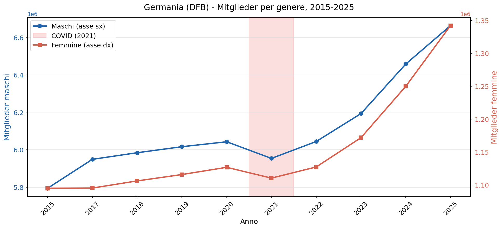{width=100%}
:::
::: {.column width="38%"}
- La federazione più grande d'Europa: **7-8 milioni** di Mitglieder totali
- Donne: circa **1,1 milioni** di membre
- Un sistema costruito su decenni di investimento

**Nota metodologica:** i Mitglieder includono anche membri passivi, non solo giocatori attivi.
Un confronto diretto con le licenze francesi o spagnole non è corretto.
:::
::::

## Germania · Il paradosso tedesco

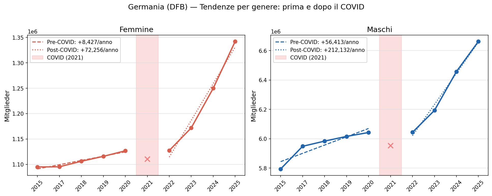{fig-align="center" height="370px"}

**Prima del COVID:** nessuna crescita nonostante la tradizione più forte d'Europa.
**Dopo il 2022:** accelerazione brusca — cambio di pendenza strutturale, non semplice rimbalzo.

# Inghilterra {background-color="#27ae60"}

**Il caso metodologicamente diverso**

Nessun registro federale pubblico disaggregato per genere.
Fonte: Sport England Active Lives Survey — dati da indagine campionaria.

*Europee femminili 2022: vincitrici in casa. L'effetto sulla partecipazione è documentato.*

## Inghilterra · Dati diversi, storia diversa {.smaller}

:::: {.columns}
::: {.column width="62%"}
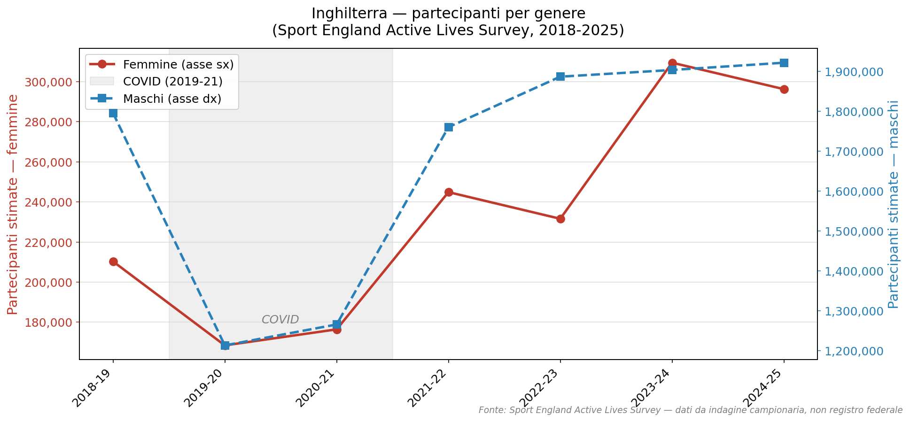{width=100%}
:::
::: {.column width="38%"}
**Attenzione metodologica.**
I dati inglesi vengono da un'indagine campionaria, non da un registro federale.
Misurano chi ha giocato almeno una volta nelle ultime 4 settimane,
non chi ha una licenza attiva.

Tre caveat:

1. Cambio soglia di partecipazione (2019)
2. Selezione ondata d'indagine (novembre)
3. Finestra più corta: solo dal 2018-19
:::
::::

## Inghilterra · L'effetto Euro 2022

:::: {.columns}
::: {.column width="62%"}
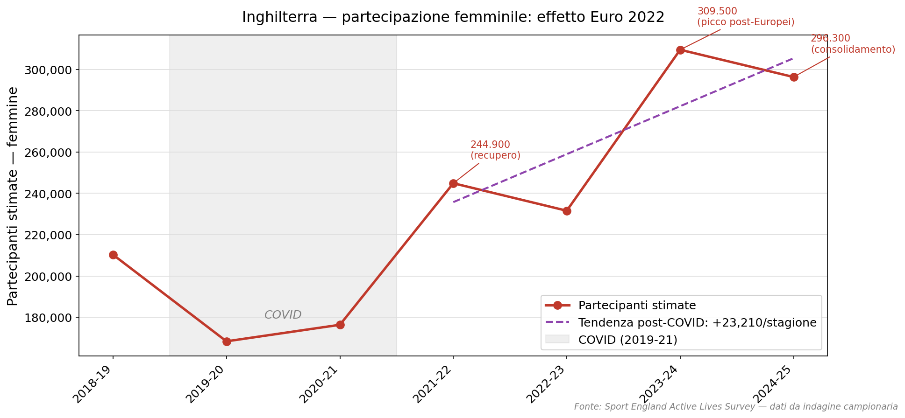{width=100%}
:::
::: {.column width="38%"}
L'Inghilterra vince gli Europei femminili nel luglio 2022.
L'effetto è **visibile e ritardato**:

- 2021-22: 244.900 (+46% sul minimo COVID)
- 2022-23: 231.600 (calo)
- 2023-24: **309.500** (picco)
- 2024-25: 296.300 (consolidamento)

Uno *shock di visibilità*: reale e duraturo, ma che decelera una volta assorbito.
:::
::::

# Francia {background-color="#3498db"}

**La crescita silenziosa**

Nessun evento singolo. Nessun picco. Solo investimento federale costante.

*D1 Arkema è professionistico dal 2018. La federazione ha costruito nel tempo.*

## Francia · Crescita silenziosa e costante

:::: {.columns}
::: {.column width="62%"}
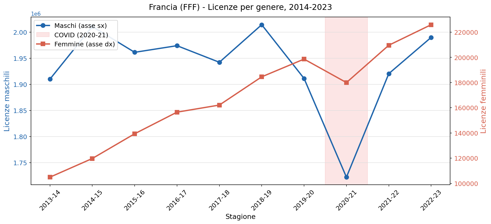{width=100%}
:::
::: {.column width="38%"}
La Francia è l'unico paese del gruppo a mostrare una crescita
**lineare e ininterrotta** per tutto il periodo 2013-2022,
senza picchi legati a singoli eventi.

Il modello ITS conferma: la pendenza post-COVID è simile a quella pre-COVID.

Non uno shock di visibilità. Investimento federale strutturale.
:::
::::

## Francia · Chi guida la crescita?

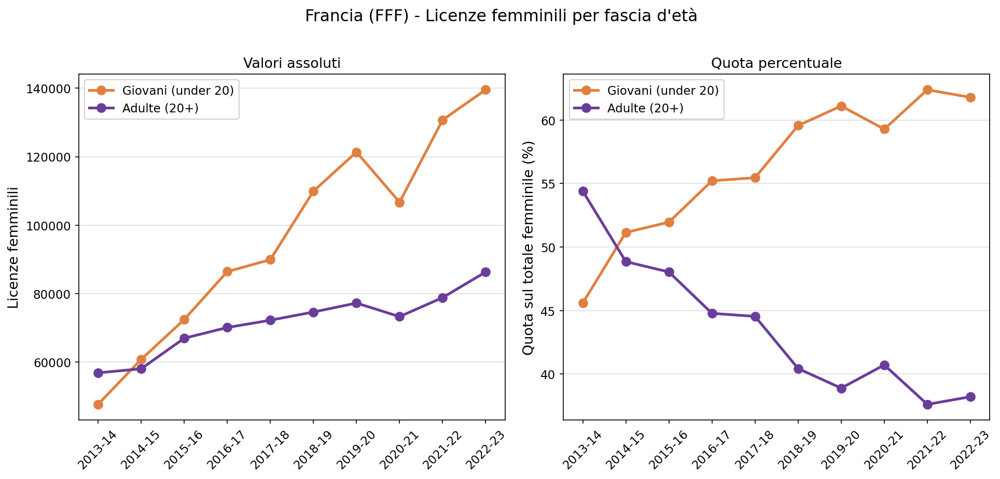{fig-align="center" height="360px"}

La crescita è **trainata dai giovani**: quota *under 20* dal **50% al 62%** in un decennio.
Il segmento maschile mostra l'effetto opposto — adulti in declino, giovani stabili, totale piatto.

# Spagna {background-color="#f1c40f"}

**La rivoluzione**

Da 31.000 licenze femminili nel 2013-14 a **80.000 nel 2022-23**.

*Barcelona Femení · Liga F · Mondiale 2023 — tre acceleratori in un decennio.*

## Spagna · La rivoluzione

:::: {.columns}
::: {.column width="62%"}
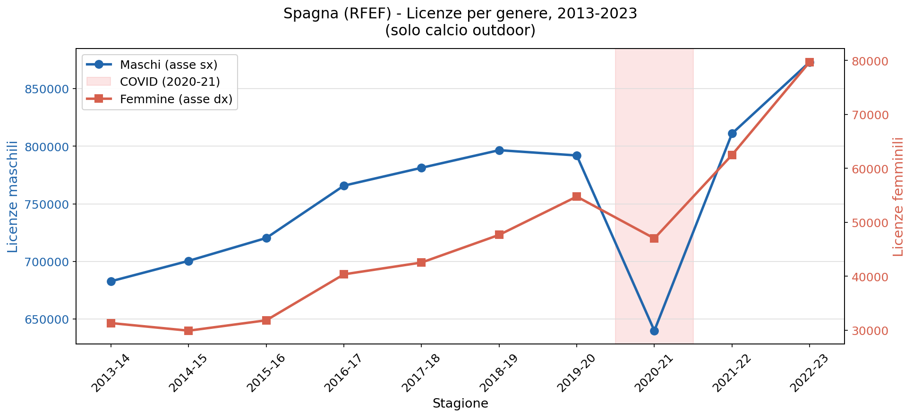{width=100%}
:::
::: {.column width="38%"}
Da 31.000 licenze femminili nel 2013-14 a **80.000 nel 2022-23**:
quasi triplicato in un decennio.

Tre fasi distinte:

1. 2016-2022: professionalizzazione della Liga F
2. Effetto Champions League: Barcelona Femení
3. Post-2022: Coppa del Mondo 2023

**Nota:** solo calcio outdoor — la Spagna separa il futsal nella fonte primaria.
:::
::::

## Spagna · Una crescita giovane

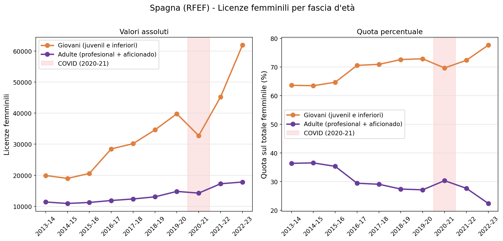{fig-align="center" height="360px"}

In Spagna il **78%** delle licenze femminili è in categorie giovanili (62% in Francia).
La base adulta resta sottile: ~18.000 licenze in un paese di 48 milioni di abitanti.

# Italia {background-color="#c0392b"}

**La base piccola che accelera**

La crescita relativa più rapida del gruppo post-COVID.
Ma si parte da lontano: 1 tesserate ogni 700 donne.

*Il motore è il settore giovanile. La conversione in calcio adulto è la domanda aperta.*

## Italia · Crescita reale, base ancora piccola

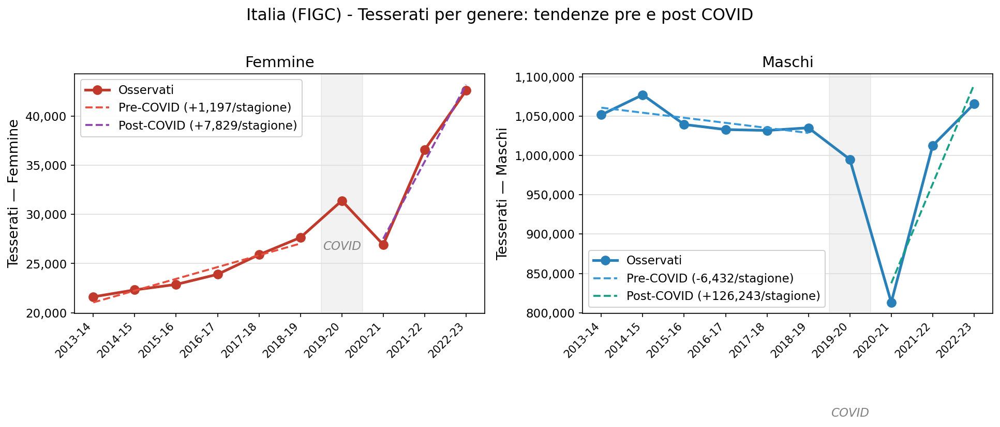{fig-align="center" height="360px"}

Pre-COVID: **+1.200** tesserate/stagione (R=0.97) · Post-COVID: **+7.800** (sei volte più rapido)

Lato maschile: trend negativo pre-COVID, shock severo (-180.000 nel 2020-21), recupero rapido.

## Italia · La pipeline: SGS vs dilettantistica

:::: {.columns}
::: {.column width="62%"}
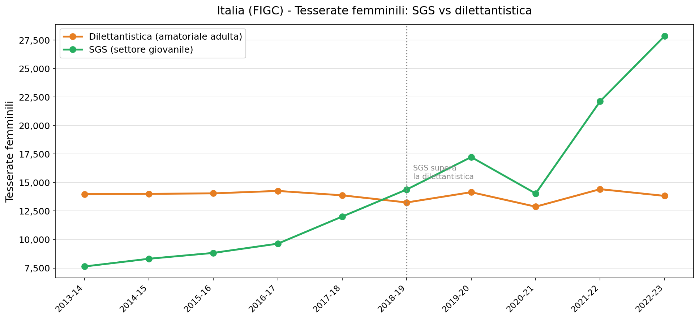{width=100%}
:::
::: {.column width="38%"}
**SGS (settore giovanile):**
da 7.634 nel 2013-14 a 27.865 nel 2022-23.
Supera la dilettantistica intorno al 2018-19 per la prima volta.

**Dilettantistica (adulte):**
piatta per tutto il decennio. Tra 13.000 e 14.500, nessuna tendenza.

La domanda aperta: le ragazze nell'SGS si convertono in tesserate adulte, o smettono?
:::
::::

# Parte 3 · Il confronto

Abbiamo analizzato ogni paese separatamente.
Ora possiamo confrontare le traiettorie di crescita usando l'indice comune.

## Quattro federazioni: 2014-15 → 2022-23

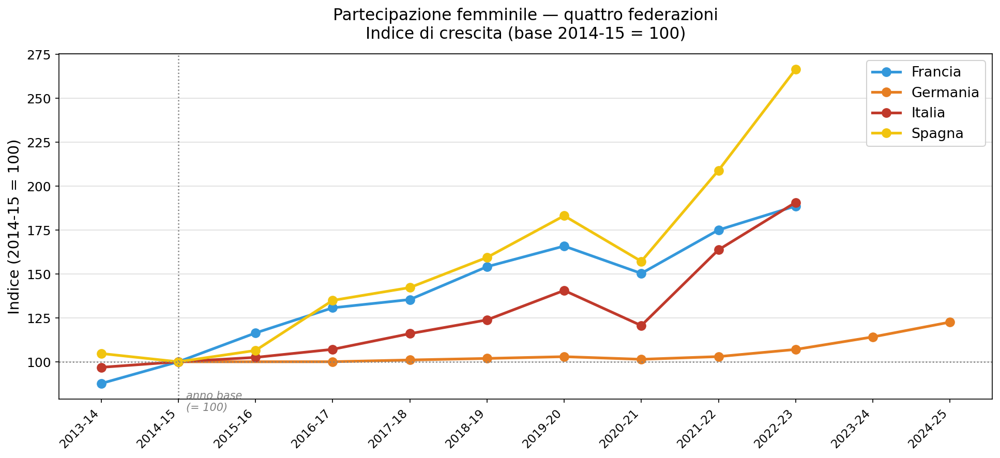{fig-align="center" height="380px"}

**Spagna** 267 · **Italia** 191 · **Francia** 189 · **Germania** 123

## Cinque federazioni: dal 2018-19

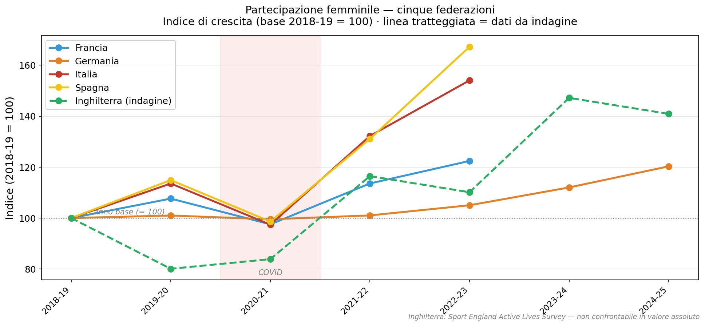{fig-align="center" height="380px"}

Inghilterra (linea tratteggiata = indagine): shock COVID più profondo per motivi metodologici, non strutturali. Effetto Euro 2022 visibile: picco 2023-24, stabilizzazione 2024-25.

## Normalizzando per popolazione {.smaller}

Esprimere la partecipazione come **quota della popolazione femminile** non cambia la storia, ma la concretizza.

| Paese       | Tasso 2022-23 (%) | Variazione        |
|-------------|-------------------|-------------------|
| Germania    | 2,78              | +0,44 pp          |
| Inghilterra | 0,67              | +0,24 pp (2018-19)|
| Francia     | 0,64              | +0,28 pp          |
| Spagna      | 0,32              | +0,20 pp          |
| Italia      | 0,14              | +0,07 pp          |

In Germania circa **1 donna su 36** è iscritta a un club di calcio.
In Italia, **1 su 700**.

La distanza assoluta è reale e grande. La crescita relativa italiana è reale e rapida.
Entrambe le cose sono vere contemporaneamente.

## Cosa ci dicono i dati — e cosa no {.smaller}

:::: {.columns}
::: {.column width="50%"}
**Cosa ci dicono**

- In tutti e cinque i paesi la partecipazione femminile cresce più rapidamente di quella maschile
- La crescita è strutturale (Francia), da eventi (Inghilterra, Germania), o entrambe (Spagna, Italia)
- L'Italia cresce dalla base più piccola al ritmo più rapido tra i paesi con dati di registro
- Il motore italiano è il settore giovanile
:::
::: {.column width="50%"}
**Cosa non ci dicono**

- Se questa crescita si tradurrà in cambiamento culturale duraturo
- Cosa succede alle ragazze italiane dopo l'SGS
- Se i tassi post-2022 sono sostenibili oltre l'effetto visibilità

---

Questa è un'analisi della partecipazione, non un verdetto.
È un punto di partenza, non una conclusione.
:::
::::

## Per saperne di più

Il notebook completo con dati, codice e metodologia:

`github.com/pacoraggio/inpat-expat`

**Prossimi passi dell'analisi:**

- Presenze agli stadi (Serie A Femminile vs altri campionati)
- Copertura mediatica: chi commenta le partite femminili?
- Confronto con dati socioeconomici (popolazione, PIL, indici di genere)
