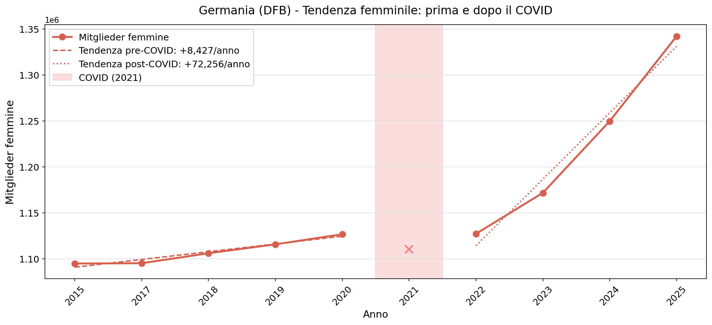

## In questa presentazione {.smaller}

Quante donne giocano a calcio nelle cinque principali federazioni europee?
Come sta crescendo questo numero, e chi lo sta guidando?

In questa analisi confrontiamo **Francia, Germania, Spagna, Italia e Inghilterra**
usando dati ufficiali di federazione (o, nel caso inglese, dati di indagine nazionale)
dal 2013-14 al 2024-25.

La struttura è la seguente:

1. Il problema della misurazione: cinque paesi, cinque sistemi diversi
2. Paese per paese: Germania, Inghilterra, Francia, Spagna, Italia
3. Il confronto: cosa cambia quando mettiamo tutto insieme

---

# Parte 1 · Il problema della misurazione

---

## Cinque paesi, cinque sistemi diversi

| Paese       | Fonte                        | Cosa misura                               |
|-------------|------------------------------|-------------------------------------------|
| Germania    | DFB Mitgliederstatistik      | Membri di club federati (attivi e passivi)|
| Francia     | INJEP                        | Licenze di gioco                          |
| Spagna      | RFEF Memoria Anual           | Licenze di gioco (calcio outdoor)         |
| Italia      | FIGC ReportCalcio            | Tesserati (licenze di gioco)              |
| Inghilterra | Sport England Active Lives   | Stima da indagine campionaria             |

::: {.callout-note}
Questi numeri **non sono direttamente confrontabili** tra loro.
Un *Mitglied* tedesco non è la stessa cosa di una *licenciée* spagnola,
e nessuno dei due è uguale a un partecipante stimato dall'indagine inglese.
:::

---

## Perché non si possono confrontare i numeri in assoluto

Il problema non è solo di definizione. È anche di **scala**:

- Germania: circa **7-8 milioni** di Mitglieder totali
- Francia: circa **2 milioni** di licenze
- Spagna: circa **1 milione** di licenze (solo calcio outdoor)
- Italia: circa **1,3 milioni** di tesserati
- Inghilterra: circa **2 milioni** di partecipanti stimati

Confrontare questi valori assoluti significherebbe confrontare mele con arance.
La soluzione è guardare **la direzione e la velocità del cambiamento**,
non il numero in sé.

---

## La soluzione: l'indice di crescita

Settiamo il valore di ciascun paese a **100** nell'anno base.

I valori successivi indicano quanto la partecipazione è cambiata
rispetto a quel punto di partenza:

- **150** = +50% rispetto all'anno base
- **80** = -20% rispetto all'anno base

In questo modo confrontiamo **la traiettoria di crescita**,
non le dimensioni assolute di ciascun sistema.

Questo approccio si chiama *indicizzazione* ed è lo strumento
che useremo nella parte comparativa.

---

# Parte 2 · Paese per paese

---

# Germania {background-color="#e67e22"}

🇩🇪

**La federazione con la tradizione più lunga**

7+ milioni di Mitglieder · 2 Mondiali femminili (2003, 2007) · 8 Europei femminili

*Eppure: nessuna crescita femminile per cinque anni prima del COVID.*

---

## Germania · La potenza storica

{width=90%}

- **~7-8 milioni** di Mitglieder totali: la federazione più grande d'Europa
- Donne: circa **1,1 milioni** di membre
- Due campionati mondiali femminili (2003, 2007), otto europei

---

## Germania · Il paradosso tedesco

{width=85%}

**Prima del COVID (2015-2020): nessuna crescita** nonostante la tradizione più forte d'Europa.
**Dopo il 2022: accelerazione brusca** — cambio di pendenza strutturale, non semplice rimbalzo.

::: {.callout-note}
Domanda aperta: effetto Euro 2022 o cambiamento strutturale più profondo?
:::

---

# Inghilterra {background-color="#27ae60"}

🏴󠁧󠁢󠁥󠁮󠁧󠁿

**Il caso metodologicamente diverso**

Nessun registro federale pubblico disaggregato per genere.
Fonte: Sport England Active Lives Survey — dati da indagine campionaria.

*Europee femminili 2022: vincitrici in casa. L'effetto sulla partecipazione è visibile.*

---

## Inghilterra · Dati diversi, storia diversa

{width=90%}

::: {.callout-important}
**Attenzione metodologica.** I dati inglesi vengono da un'indagine campionaria,
non da un registro federale. Misurano chi ha *giocato* almeno una volta
nelle ultime 4 settimane, non chi ha una licenza attiva.
:::

Tre caveat: cambio soglia (2019), selezione ondata (novembre), **finestra più corta**: solo dal 2018-19.

---

## Inghilterra · L'effetto Euro 2022

{width=85%}

L'Inghilterra vince gli Europei femminili nel luglio 2022.
L'effetto sulla partecipazione è **visibile e ritardato**:
picco a 309.500 nel 2023-24, poi consolidamento a 296.300 nel 2024-25.

Uno *shock di visibilità*: reale e duraturo, ma che decelera una volta assorbito l'impulso iniziale.

---

# Francia {background-color="#3498db"}

🇫🇷

**La crescita silenziosa**

Nessun evento singolo. Nessun picco. Solo investimento federale costante.

*D1 Arkema, il campionato femminile più seguito del paese, è stato professionistico dal 2018.*

---

## Francia · Crescita silenziosa e costante

{width=90%}

La Francia è l'unico paese del gruppo a mostrare una crescita
**lineare e ininterrotta** per tutto il periodo 2013-2022,
senza picchi legati a singoli eventi.

Il modello ITS conferma: la pendenza post-COVID è simile a quella pre-COVID.

---

## Francia · Chi guida la crescita?

{width=85%}

La crescita francese è **trainata dai giovani**:
dal 2013-14 al 2022-23 la quota *under 20* passa
dal **50% al 62%** del totale delle licenze femminili.

Il segmento maschile mostra un effetto composizione opposto:
adulti in declino lento, giovani stabili — il totale sembra piatto ma non lo è.

---

# Spagna {background-color="#f1c40f"}

🇪🇸

**La rivoluzione**

Da 31.000 licenze femminili nel 2013-14 a **80.000 nel 2022-23**.

*Barcelona Femení · Liga F · Mondiale 2023 — tre acceleratori in un decennio.*

---

## Spagna · La rivoluzione

{width=90%}

Da 31.000 licenze femminili nel 2013-14 a **80.000 nel 2022-23**:
quasi triplicato in un decennio.

Nota tecnica: la Spagna è l'unica federazione del gruppo
a separare calcio outdoor e futsal nella fonte primaria.
Tutti i confronti usano solo il calcio outdoor per omogeneità.

---

## Spagna · Una crescita giovane

{width=85%}

In Spagna il **78%** delle licenze femminili appartiene a categorie giovanili
(contro il 62% in Francia). La base adulta resta sottile: ~18.000 licenze.

Tre fasi distinte:

1. 2016-2022: professionalizzazione della Liga F
2. Effetto Champions League: i titoli del Barcellona Femení
3. Post-2022: Coppa del Mondo 2023

---

# Italia {background-color="#c0392b"}

🇮🇹

**La base piccola che accelera**

La crescita relativa più rapida del gruppo post-COVID.
Ma si parte da lontano: 1 tesserate ogni 700 donne.

*Il motore è il settore giovanile. La conversione in calcio adulto è la domanda aperta.*

---

## Italia · Crescita reale, base ancora piccola

{width=90%}

L'Italia mostra la crescita relativa più rapida del periodo post-COVID
tra i quattro paesi con dati di registro:

- Pre-COVID: **+1.200** tesserate per stagione (costante, R=0.97)
- Post-COVID: **+7.800** per stagione (sei volte più rapido)

---

## Italia · La pipeline: SGS vs dilettantistica

{width=85%}

**SGS (settore giovanile):** da 7.634 nel 2013-14 a 27.865 nel 2022-23 — triplicato.
Supera la dilettantistica intorno al 2018-19 per la prima volta.

**Dilettantistica (adulte amatoriali):** piatta per tutto il decennio.

La domanda che i dati pongono ma non risolvono:
le ragazze che entrano nell'SGS si convertono in tesserate adulte, o smettono?

---

# Parte 3 · Il confronto

---

## Quattro federazioni: 2014-15 → 2022-23

{width=90%}

- **Spagna:** indice 267. Quasi triplicata.
- **Italia:** indice 191. Accelerazione forte, base piccola.
- **Francia:** indice 189. Crescita costante e lineare.
- **Germania:** indice 123. La più lenta, ma partiva già dalla vetta.

---

## Cinque federazioni: dal 2018-19

{width=90%}

Con l'Inghilterra nel confronto (linea tratteggiata = dati da indagine):

- Lo shock COVID inglese è il più profondo: le due metodologie rispondono diversamente allo stesso shock
- Spagna e Italia in parallelo fino al 2021-22, poi la Spagna accelera
- L'effetto Euro 2022 inglese è visibile: picco 2023-24, poi stabilizzazione

---

## Normalizzando per popolazione

Esprimere la partecipazione femminile come **quota della popolazione femminile**
cambia leggermente le proporzioni, non la storia.

| Paese       | Tasso (%) | Variazione        |
|-------------|-----------|-------------------|
| Germania    | 2,78      | +0,44 pp          |
| Inghilterra | 0,67      | +0,24 pp (2018-19)|
| Francia     | 0,64      | +0,28 pp          |
| Spagna      | 0,32      | +0,20 pp          |
| Italia      | 0,14      | +0,07 pp          |

In Germania, circa **1 donna su 36** è iscritta a un club di calcio.
In Italia, **1 su 700**.

---

## Cosa ci dicono i dati — e cosa no

**Cosa ci dicono:**

- In tutti e cinque i paesi la partecipazione femminile cresce più rapidamente di quella maschile
- La crescita è strutturale (Francia), trainata da eventi (Inghilterra, Germania), o entrambe (Spagna, Italia)
- L'Italia cresce dalla base più piccola al ritmo più rapido tra i paesi con dati di registro
- Il motore italiano è il settore giovanile: la conversione in calcio adulto è la domanda aperta

**Cosa non ci dicono:**

- Se questa crescita si tradurrà in un cambiamento culturale duraturo
- Cosa succede alle ragazze italiane dopo l'SGS
- Se i tassi post-2022 sono sostenibili oltre l'effetto visibilità

---

## Per saperne di più

Il notebook completo con dati, codice e metodologia è disponibile su:

`github.com/pacoraggio/inpat-expat`

Prossimi passi dell'analisi:

- Presenze agli stadi (Serie A Femminile vs altri campionati)
- Copertura mediatica: chi commenta le partite femminili?
- Confronto con dati socioeconomici (popolazione, PIL, indici di genere)
